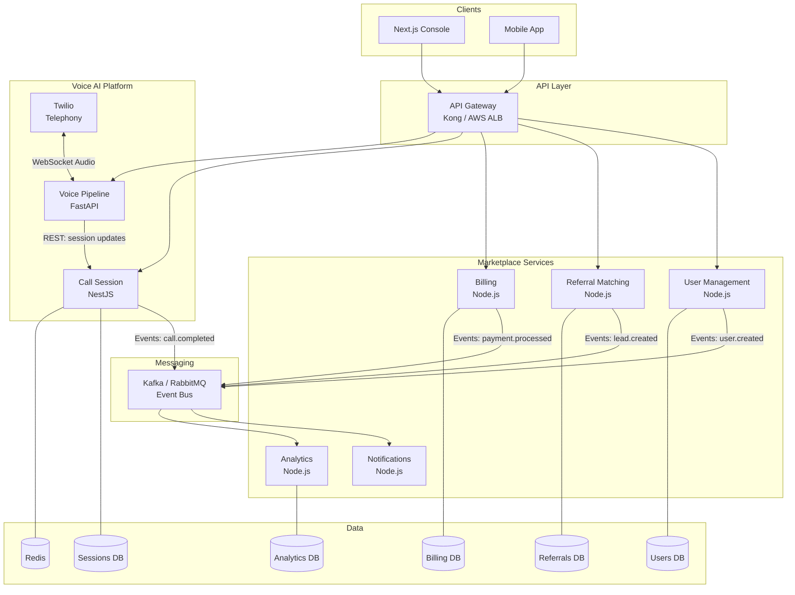
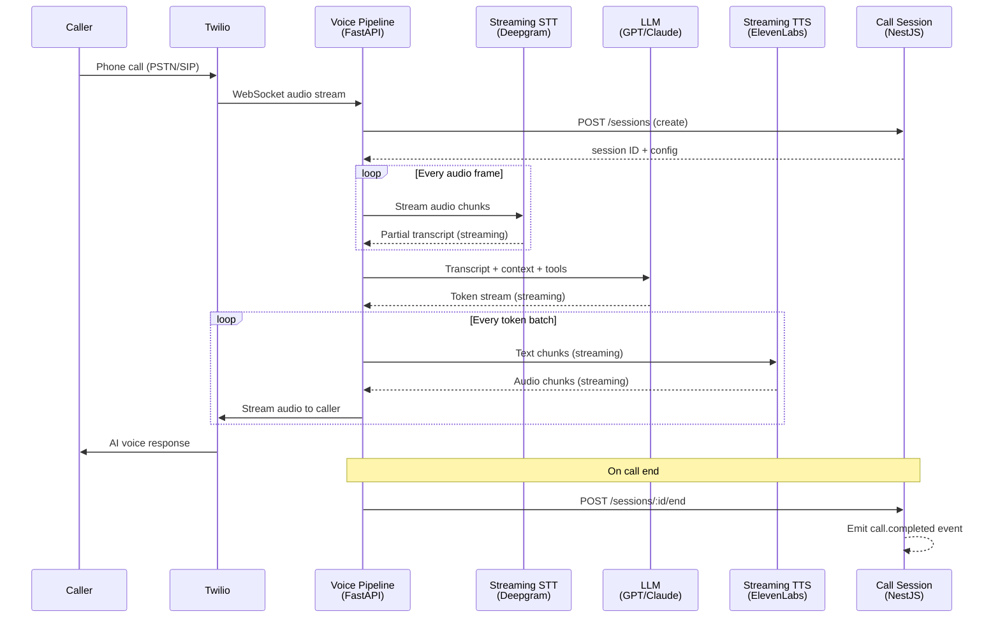
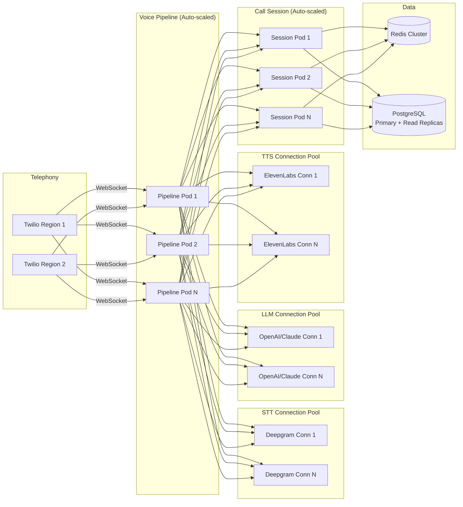
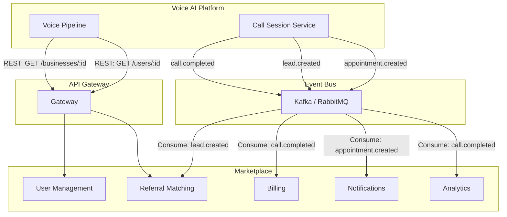
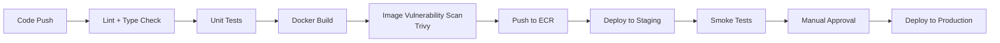

# BoomersHub Voice AI Agent — Architecture Document

**Author: Fahim Hasan**
**Date: February 2026**

---

## A1. Microservices Migration Strategy

### Service Decomposition

The Node.js monolith is decomposed along **domain boundaries** — each service owns a single business capability, its data, and its deployment lifecycle.

| Service | Responsibility | Why This Boundary |
|---------|---------------|-------------------|
| **User Management** | Profiles, auth, preferences, roles | Core identity domain; high read traffic, independent auth changes shouldn't risk billing or calls |
| **Referral Matching** | Lead matching, provider ranking, search | Complex matching algorithms evolve independently; needs its own query-optimized data store |
| **Billing** | Invoices, payments, subscription management | Strict compliance/audit requirements; must deploy/test independently from feature work |
| **Notifications** | Email, SMS, push notifications, templates | High fan-out, bursty workload; ideal first extraction candidate — lowest coupling to other domains |
| **Analytics** | Dashboards, reports, aggregations | Read-heavy CQRS pattern; benefits from denormalized projections without affecting transactional services |
| **Call Session** | Call lifecycle, metadata, outcomes, events | New Voice AI domain; no legacy entanglement — greenfield extraction (implemented in this repo) |

### Target Architecture Diagram



### Communication Patterns

| Interaction | Pattern | Justification |
|-------------|---------|---------------|
| Console → Call Session (CRUD) | **REST** (sync) | User-facing reads need immediate responses |
| Voice Pipeline → Call Session | **REST** (sync) | Pipeline needs session state to route calls; latency-sensitive |
| Call Session → Notifications | **Event** (async) | "Call completed" triggers notification — no need to block the caller |
| Call Session → Analytics | **Event** (async) | Analytics ingestion is eventually consistent by nature |
| Billing → Notifications | **Event** (async) | Payment confirmations are fire-and-forget notifications |
| Referral Matching → User Management | **REST** (sync) | Matching needs real-time user profile data for ranking |
| Any service → Auth | **REST** (sync) | Token validation must be synchronous at request time |

### Data Strategy

1. **Database-per-service**: Each service gets its own PostgreSQL schema. No cross-service joins.
2. **Migration approach**: Use Change Data Capture (Debezium on the monolith DB) during transition. New writes go to the service DB; the monolith's table becomes read-only for that domain, then is dropped.
3. **Eventual consistency**: Domain events propagate state changes. Services maintain local projections of data they need (e.g., Analytics stores denormalized call summaries).
4. **Cross-service queries**: Use the API Gateway to compose responses from multiple services, or build dedicated read-model projections for dashboard views.

### Migration Sequence

| Order | Service | Risk | Rationale |
|-------|---------|------|-----------|
| 1 | **Notifications** | Low | Stateless fan-out; easiest to extract and test independently |
| 2 | **Analytics** | Low | Read-only; can dual-write to new service while monolith remains source |
| 3 | **Call Session** | Low | Greenfield — no legacy data to migrate |
| 4 | **Billing** | Medium | Strict data consistency requirements; needs careful dual-write validation |
| 5 | **Referral Matching** | Medium | Complex queries; needs performance validation with its own DB |
| 6 | **User Management** | High | Core dependency for all other services; extract last to minimize blast radius |

**Pattern: Strangler Fig** — An API gateway routes traffic. New routes point to extracted services; legacy routes stay on the monolith. Services are extracted one at a time with feature flags controlling the cutover. Rollback = flip the flag.

### Avoiding a Distributed Monolith

- **No shared databases** — each service owns its data exclusively.
- **No synchronous chains** — if Service A calls B calls C, redesign with events or aggregate the data.
- **Independent deployability** — every service has its own CI/CD pipeline and can ship without coordinating.
- **Contract testing** — use consumer-driven contract tests (Pact) to catch breaking API changes before deployment.
- **Bounded contexts** — services communicate through well-defined APIs and events, not internal data structures.

---

## A2. Voice AI Platform Architecture

### End-to-End Pipeline



### Latency Budget (Target: < 1.5s per AI turn)

| Stage | Current | Target | Optimization |
|-------|---------|--------|-------------|
| **STT** (partial recognition) | ~800ms | 300–400ms | Use streaming STT with partial hypotheses; trigger LLM on confidence threshold, not end-of-utterance |
| **LLM** (first token) | ~1200ms | 400–500ms | Token-level streaming; warm connection pools; use smaller models for simple intents; prompt caching |
| **TTS** (first audio chunk) | ~700ms | 300–400ms | Start TTS as soon as first LLM tokens arrive; use chunked streaming, not full-sentence synthesis |
| **Network + overhead** | ~300ms | ~200ms | Co-locate services in same AZ; persistent HTTP/2 connections; minimize serialization overhead |
| **Total** | **~3.0s** | **~1.3s** | |

### Barge-In Handling (Duplex Audio)

The system maintains full-duplex audio and an `is_ai_speaking` flag per session in Redis:

1. **Detection**: Voice Activity Detection (VAD) on incoming audio while AI is speaking.
2. **Interrupt**: When barge-in detected:
   - Send TTS stop command to ElevenLabs immediately.
   - Cancel in-flight LLM generation.
   - Send silence frame to Twilio to stop playback.
   - Mark partial AI response as `interrupted` in transcript.
3. **Resume**: Feed the new user utterance back into the STT → LLM pipeline with full conversation context (including the interrupted response).

### Fault Tolerance

| Failure | Detection | Fallback |
|---------|-----------|----------|
| **LLM provider down** | Timeout > 2s or 5xx response | Switch to backup provider (Claude ↔ GPT); if both down, play "I'm having difficulty, let me connect you to a person" and trigger handoff |
| **STT returns garbage** | Confidence score < 0.3 for 3+ consecutive utterances | Ask caller to repeat; if persists, switch STT provider or trigger human handoff |
| **WebSocket drops** | Heartbeat timeout (10s) | Attempt reconnect with session ID within 5s; if fails, mark session as `failed`, trigger callback flow |
| **TTS degraded** | Latency > 1s or error rate > 10% | Switch to backup TTS provider; fall back to lower-quality but faster voice model |

### AI-to-Human Handoff

**Trigger detection** (any of):
- Caller explicitly asks: "Let me talk to a real person" (intent detection via LLM).
- Frustration signals: repeated questions, elevated voice energy, negative sentiment score > threshold.
- Low LLM confidence: model uncertainty above threshold for 2+ turns.
- Business rules: e.g., billing disputes always route to human.

**Handoff mechanics**:
1. Pipeline notifies Call Session service: `PATCH /sessions/:id/status` → `transferring`.
2. Call Session prepares context package: transcript, detected intent, caller info, session summary.
3. Pipeline sends context to the agent queue system (e.g., Twilio Flex, Amazon Connect).
4. Twilio `<Dial>` conference bridge connects caller to human agent.
5. Human agent sees the full transcript and context in their UI before accepting.
6. AI stays on the call in listen-only mode for 5 seconds to enable smooth transition, then disconnects.

---

## A3. Scalability Architecture (50 → 500+ Concurrent Calls)

### Horizontal Scaling Diagram



### Session State

- **Hot state (Redis)**: Active call metadata, `is_ai_speaking` flag, partial transcripts, pipeline stage cursors. TTL = session duration + 5 minutes.
- **Persistent state (PostgreSQL)**: Full session records, completed transcripts, outcomes. Written on session create and session end.
- **Stateless scaling**: Pipeline workers and session pods are stateless. WebSocket connections use session ID in Redis, so any pod can serve any session. No session affinity required.

### Connection Management

- **External AI providers**: Pre-warmed persistent HTTP/2 connection pools per worker. Each pipeline pod maintains ~10 persistent connections to each provider. Pool size auto-adjusts based on concurrent call count.
- **WebSocket fan-out**: Console WebSocket connections are distributed across session pods via Redis pub/sub. Any pod can publish; all subscribed pods forward to their connected clients.
- **Twilio WebSockets**: Each Twilio call maintains one WebSocket to one pipeline pod. The pod is selected by the load balancer (least-connections strategy).

### Backpressure & Load Shedding

1. **Admission control**: Track concurrent active calls in Redis (`INCR/DECR`). When count exceeds threshold (e.g., 480 of 500 capacity), new calls receive a "We're experiencing high volume" message and are queued or offered callback.
2. **Per-provider rate limiting**: Track API call rates to Deepgram/OpenAI/ElevenLabs. When approaching provider rate limits, throttle new calls.
3. **Graceful degradation**: Under extreme load, disable optional features first (sentiment analysis, detailed summarization) before rejecting calls.
4. **Circuit breakers**: Per-provider circuit breakers (closed → open → half-open). When a provider is unhealthy, fast-fail and switch to backup.

### Cost Model (500 Concurrent Calls)

Assuming average call duration of 5 minutes, ~6,000 calls/hour:

| Component | Unit Cost | Monthly Estimate |
|-----------|-----------|-----------------|
| **Twilio** (voice minutes) | ~$0.015/min | ~$32,400 |
| **Deepgram** (STT streaming) | ~$0.0043/min | ~$9,300 |
| **OpenAI GPT-4o** (LLM tokens) | ~$0.005/call avg | ~$21,600 |
| **ElevenLabs** (TTS characters) | ~$0.003/min equiv | ~$6,500 |
| **AWS Compute** (ECS Fargate) | ~20 tasks × $0.05/hr | ~$720 |
| **PostgreSQL RDS** (db.r6g.xlarge) | ~$0.38/hr | ~$274 |
| **Redis ElastiCache** | ~$0.15/hr | ~$108 |
| **Total** | | **~$71,000/mo** |

**Biggest cost drivers**: Twilio voice minutes (46%) and LLM API calls (30%). Optimizations: negotiate volume pricing, use smaller models for simple intents, cache common responses.

---

## A4. Integration Architecture

### Marketplace ↔ Voice AI Integration



**Key principle**: Voice AI reads marketplace data via REST APIs through the gateway (synchronous, when the pipeline needs business context for a live call). Voice AI writes outcomes via events (asynchronous, after the call ends).

### Event Schemas

**`call.completed`**
```json
{
  "event": "call.completed",
  "version": 1,
  "sessionId": "uuid",
  "businessId": "uuid",
  "callerPhone": "+1...",
  "durationSeconds": 320,
  "outcome": "appointment_booked",
  "summary": "Booked dental cleaning for March 5",
  "tags": ["high_intent", "follow_up_required"],
  "createdAt": "2026-01-01T00:00:00Z",
  "traceId": "uuid"
}
```

**`lead.created`**
```json
{
  "event": "lead.created",
  "version": 1,
  "sessionId": "uuid",
  "businessId": "uuid",
  "callerPhone": "+1...",
  "intent": "dental_appointment",
  "confidence": 0.92,
  "extractedInfo": { "preferredDate": "2026-03-05", "serviceType": "cleaning" },
  "traceId": "uuid"
}
```

### API Gateway

- **Technology**: Kong (open-source) or AWS ALB + Lambda authorizers.
- **Routing**: `/api/v1/marketplace/*` → marketplace services; `/api/v1/voice/*` → voice AI services.
- **Authentication**: JWT tokens issued by the shared auth service. Gateway validates tokens and injects `userId`/`businessId` into request headers.
- **Rate limiting**: Per-tenant, per-endpoint rate limits. Voice AI endpoints get higher limits than marketplace CRUD.
- **Versioning**: URL-based (`/v1/`, `/v2/`) for breaking changes; header-based (`Accept-Version`) for minor variations.

### Shared Services

| Service | Ownership | Strategy |
|---------|-----------|----------|
| **Auth/Identity** | Shared library + centralized token issuer | Deployed independently; both platforms validate JWTs locally using shared public keys |
| **Notifications** | Marketplace team | Voice AI publishes events; Notifications service consumes and routes (email, SMS, push) |
| **Analytics** | Marketplace team | Voice AI events flow into the same analytics pipeline; dashboards query both call and marketplace data |

---

## B1. 90-Day Infrastructure Roadmap

### Month 1 — Foundation

**Containerization**:
- NestJS: Multi-stage Docker build — Node 20 Alpine, `npm ci --omit=dev`, non-root user (implemented in this repo).
- FastAPI: Multi-stage Docker build — Python 3.11-slim, pip install from requirements.txt, gunicorn + uvicorn workers.
- All images tagged with git SHA for traceability.

**CI/CD Pipeline (GitHub Actions)**:



- Monorepo-aware: Only build/deploy services whose files changed (using path filters).
- Tests are parallelized: NestJS and FastAPI test suites run concurrently.

**Orchestration: ECS Fargate**

Chosen over Kubernetes for a team of 5–7 engineers because:
- No cluster management overhead (no nodes to patch, no control plane to maintain).
- Native AWS integration (ALB, CloudWatch, Secrets Manager, IAM roles per task).
- Simpler learning curve — the team can focus on product, not infrastructure.
- Scales from 8 to 20+ services without operational burden.
- Migrate to EKS later if the team grows to 15+ engineers or needs multi-cloud.

### Month 2 — Automation

**Infrastructure as Code: Terraform**

Chosen over CDK because:
- Cloud-agnostic (relevant if BoomersHub considers multi-cloud or provider migration).
- Larger ecosystem of modules and community support.
- State management is explicit and auditable.

What gets codified first (in priority order):
1. VPC, subnets, security groups.
2. ECS cluster, task definitions, service configs.
3. RDS PostgreSQL instances (per-service).
4. ElastiCache Redis.
5. ECR repositories.
6. IAM roles and policies.
7. Secrets Manager entries.

**Environment Strategy**:
- `dev` — local Docker Compose (implemented).
- `staging` — mirrors production topology on smaller instances. Voice AI load simulation uses a synthetic call generator service that replays recorded audio files through the pipeline.
- `production` — full capacity with auto-scaling.

**Secrets Management**:
- AWS Secrets Manager for all API keys (Twilio, Deepgram, OpenAI, ElevenLabs).
- ECS tasks reference secrets via `valueFrom` in task definitions — secrets are injected as environment variables at container start, never baked into images.
- Rotation policies for database credentials (90-day automatic rotation).

### Month 3 — Observability & Production Readiness

**Monitoring Stack**:
- **Metrics**: Prometheus-compatible exporters (or CloudWatch Embedded Metrics Format) from all services.
- **Dashboards**: Grafana (or CloudWatch Dashboards) with dedicated Voice AI dashboard.
- **Tracing**: AWS X-Ray or OpenTelemetry with Jaeger for distributed tracing across the full call pipeline.

**Voice AI Metrics**:
- Call latency: p50, p95, p99 per pipeline stage (STT, LLM, TTS).
- Concurrent active calls.
- WebSocket connection count and drop rate.
- STT/LLM/TTS error rates by provider.
- Barge-in frequency and success rate.
- Human handoff rate.

**Centralized Logging**:
- Structured JSON logging from all services.
- Correlation ID (`traceId`) propagated through HTTP headers and event payloads.
- Shipped to OpenSearch via Fluent Bit sidecar containers.
- A single call can be traced end-to-end: Twilio → Pipeline → STT → LLM → TTS → Session → Events.

**5 Critical Alerts (Day-One)**:

| Alert | Threshold | Channel |
|-------|-----------|---------|
| Voice AI error rate | > 5% over 5 minutes | PagerDuty (on-call) |
| p95 call latency | > 2.0s over 10 minutes | PagerDuty (on-call) |
| WebSocket disconnects | > 50/minute | Slack #voice-ai-alerts |
| RDS CPU utilization | > 80% for 10 minutes | Slack #infra-alerts |
| Zero `call.completed` events | During business hours for > 15 minutes | PagerDuty (on-call) |

**Deployment Strategy: Rolling + Canary**:
- **Marketplace services**: Rolling deployments (ECS rolling update, `minimumHealthyPercent: 50`, `maximumPercent: 200`). Sufficient for CRUD services with health checks.
- **Voice AI services**: Canary deployments — route 5% of new calls to the new version, monitor error rate and latency for 10 minutes, then promote to 100% or auto-rollback.
- **Zero downtime**: Health checks gate traffic. Old tasks drain existing connections before stopping. WebSocket clients reconnect automatically.

---

## B2. Disaster Recovery & Incident Response

### On-Call Structure (5–7 engineers)

- **Rotation**: Weekly, 1 primary + 1 secondary.
- **Escalation**: Primary responds within 5 minutes → Secondary at 15 minutes → Engineering Manager at 30 minutes.
- **Handoff**: End-of-week handoff meeting (15 min) to review open incidents and system health.
- **Compensation**: On-call stipend + time-off-in-lieu for after-hours pages.

### Runbook: "Voice AI Calls Failing at > 5% Error Rate"

1. **Acknowledge** the alert within 5 minutes. Open an incident channel.
2. **Triage** — Check the Voice AI dashboard:
   - Error breakdown by stage: STT errors? LLM timeouts? TTS failures? Internal exceptions?
   - Is the error rate uniform or concentrated on specific businesses/regions?
3. **Check external providers**:
   - Deepgram status page → if degraded, switch to backup STT.
   - OpenAI/Anthropic status page → if degraded, switch LLM provider.
   - ElevenLabs status page → if degraded, switch to backup TTS.
   - Twilio status page → if regional outage, check if calls can route through alternate region.
4. **Check internal systems**:
   - PostgreSQL: connection pool exhaustion? Slow queries?
   - Redis: memory pressure? Replication lag?
   - ECS: task crashes? OOM kills? Deployment in progress?
5. **Mitigate**:
   - If provider issue: activate backup provider via feature flag.
   - If capacity issue: scale up ECS tasks manually.
   - If code bug from recent deploy: rollback to previous task definition.
6. **Communicate**: Update status page and stakeholder Slack channel every 15 minutes.
7. **Resolve**: Confirm error rate returns to baseline. Monitor for 30 minutes before closing.

### Post-Mortem Template (Blameless)

| Section | Content |
|---------|---------|
| **Incident summary** | One-paragraph description of what happened |
| **Timeline** | Minute-by-minute: detection → triage → mitigation → resolution |
| **Root cause** | Technical root cause (e.g., "ElevenLabs rate limit exceeded due to retry storm") |
| **Contributing factors** | What made it worse (e.g., "No circuit breaker on TTS client") |
| **Impact** | Duration, # affected calls, # failed calls, revenue impact estimate |
| **What went well** | Detection was fast, runbook was followed, backup provider worked |
| **What went poorly** | Took 20 min to identify root cause, no automated failover |
| **Action items** | Each with owner and deadline: "Add circuit breaker to TTS client — @engineer — March 1" |
| **Lessons learned** | Systemic improvements beyond this specific incident |

---

*End of Architecture Document*
